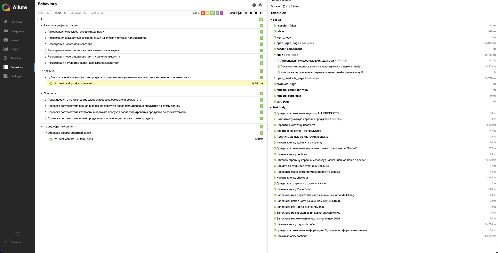

## Автотесты для сайта https://automationexercise.com

### Всего было создано 11 автотестов затрагивающие основной функционал сайта. В основном положительные. При разработке были использованы следующие патерны - Page object, fixture, allure, faker

### Все тесты приближены к реальным, присутствуют проверки, используются исключительно случайные значения

## Важно

- Время выполнения всех тестов в allure не точное, иногда сайт просто вставал и не происходило ничего
- Добавлять дополнительные проверки на url страницы не стал т.к. сайт является тестовым и производительность не самая лучая, поэтому работает крайне нестабильно, ожидания не всегда помогают
- Ставить xdist для паралельного запуска тестов тоже не стал делать
- Делал в основном только положительные тексты т.е. проверки на часть незаполненных полей делать не стал
- Сайт требует впн, а при использовывании некоторых впн приходится повторно соглашаться с политикой конфиденциальности и сборе куки. В автотестах этого нет т.к. использовался впн, который не требует повторного принятия при перезагруски браузера

## Список всех тестов

### Авторизация/регистрация
- Регистрация нового пользователя и выход из аккаунта
- Авторизация с несуществующими данными
- Авторизация с существующими данными из списка тестовых пользователей
- Регистрация нового пользователя и удаление аккаунта
- Регистрация с существующими данными пользователя

### Форма обратной связи
- Отправка формы обратной связи

### Продукты и корзина
- Проверка соответствия полей продукта в списке продуктов и карточке продукта
- Проверка соответствия категории в карточке продукта после фильтрования продуктов по этой категории
- Поиск продукта по ключевому слову и проверка соответсия результата
- Проверка соответствия бренда в карточке продукта после фильтрования продуктов по этому бренду
- Добавить случайное количество продукта, проверить отображаемое количество в корзине и оформить заказ

### Allure

